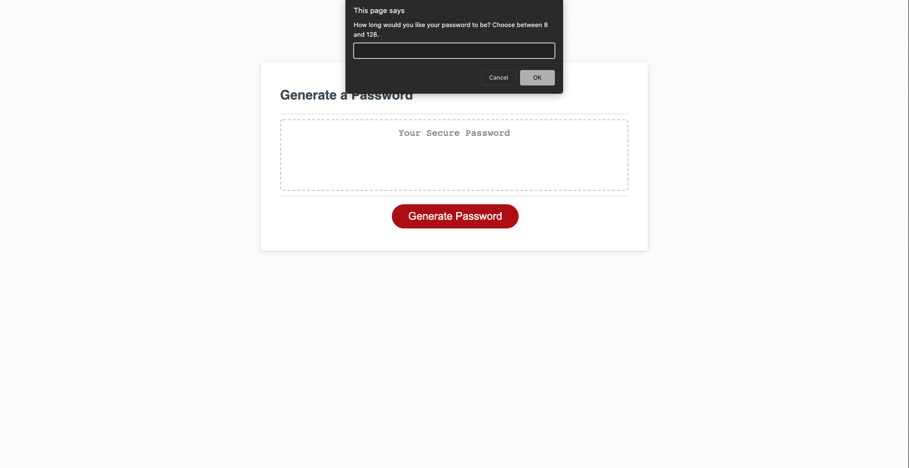

# 03 JavaScript: Password Generator

Link to deployed app: https://bryanborek.github.io/03-Password-Generator/ 

Link to the project Github: https://github.com/BryanBorek/03-Password-Generator

This password generator allows the user to generate a password between 8-128 characters in length.

The user can choose to add up to 4 different types of characters to be randomly selected. These types are: Uppercase, Lowercase, Special, and Numeric.

Validation is given for the length and options selected. 

Password is then written to the page